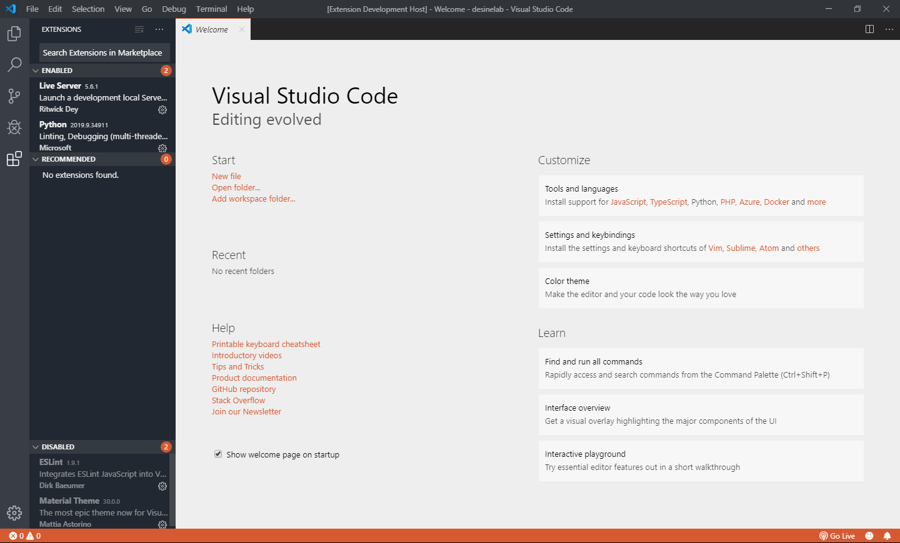
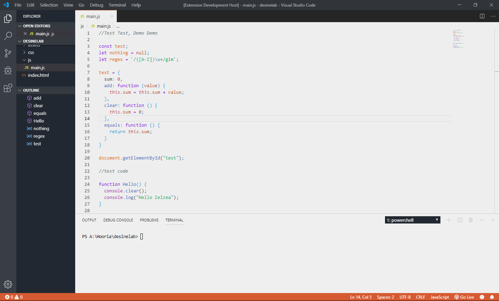
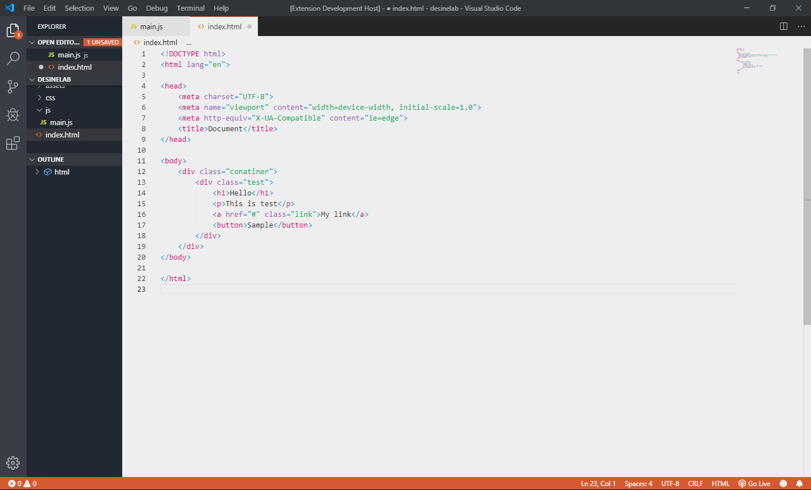
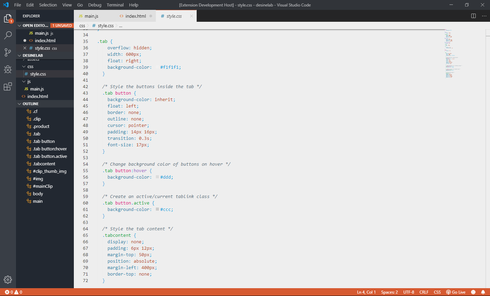

# Zelzea

A beautiful color theme for Visual Studio Code

## Installation

Launch VS Code Quick Open (⌘+P), paste the following command, and press enter.  
ext install zelzea
Or install this theme from the extension panel (search for "zelzea").
You can find this theme in the [Visual Studio Code Marketplace](https://marketplace.visualstudio.com)

## Screenshots

## Issues Or Feedback

If you find any issues, bugs or feedback please feel free to [File an issue](https://github.com/HooriaHIC/zelzea/issues).

#### Enjoy Coding!
